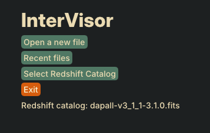
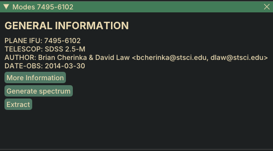
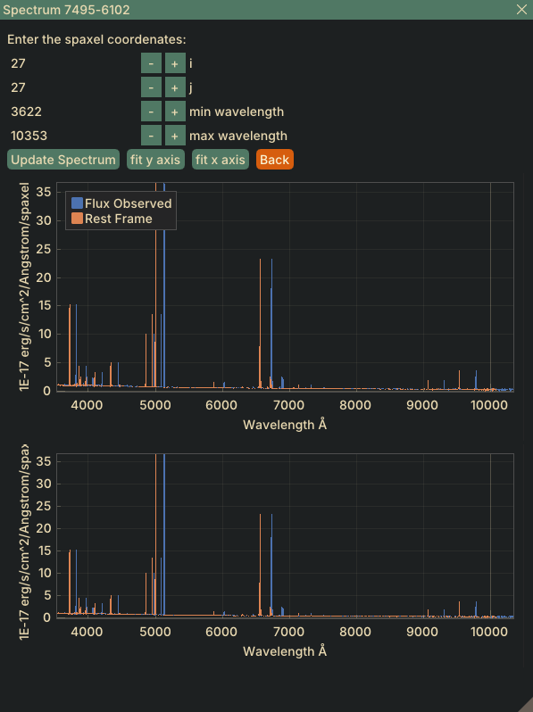

# InterVisor

 <!-- Puedes agregar una imagen si tienes un logo -->

## Descripción

**InterVisor** es un procesador, analizador y manejador de GUI para datacubes del proyecto [MaNGA](https://www.sdss.org/surveys/manga/) del [Sloan Digital Sky Survey](https://www.sdss.org/). Este software está escrito en **Python** y proporciona una interfaz intuitiva y completa para el estudio de los datos de las galaxias observadas en MaNGA.

## Características

- **Interfaz Gráfica de Usuario (GUI)**: Facilita la interacción con los datos de manera visual y amigable.
- **Procesamiento de Datos**: Herramientas robustas para el análisis y manipulación de datacubes.
- **Compatibilidad**: Diseñado específicamente para trabajar con los datos de MaNGA del Sloan Digital Sky Survey.
- **Desarrollo Abierto**: Código abierto y extensible para futuras mejoras y colaboraciones.

## Capturas de Pantalla





## Instalación

Para instalar y ejecutar InterVisor en tu máquina local, sigue estos pasos:

1. **Clonar el Repositorio**

   ```bash
   git clone https://github.com/renatosanz/InterVisor
   cd InterVisor
   ```

2. **Instalar las Dependencias**

   ```bash
   pip install -r deps.txt
   ```

3. **Ejecutar la Aplicación**

   ```bash
   python visor.py
   ```

## Uso

Después de instalar el software, puedes ejecutar InterVisor utilizando el siguiente comando:

```bash
python main.py
```

Esto abrirá la interfaz gráfica donde podrás cargar y analizar los datacubes de MaNGA.

## Créditos

InterVisor fue desarrollado por **Renato Sanchez** durante la estancia del programa Delfín 2024. Este proyecto fue ideado con el fin de crear un software intuitivo y completo para el estudio de datos de galaxias.

## Licencia

Este proyecto está licenciado bajo la Licencia MIT. Consulta el archivo [LICENSE](LICENSE) para obtener más información.

---

¡Gracias por usar InterVisor! Si tienes alguna pregunta o sugerencia, no dudes en contactarnos.
